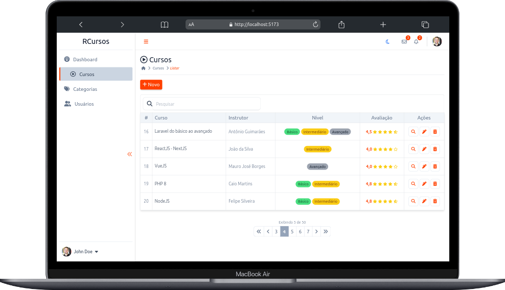
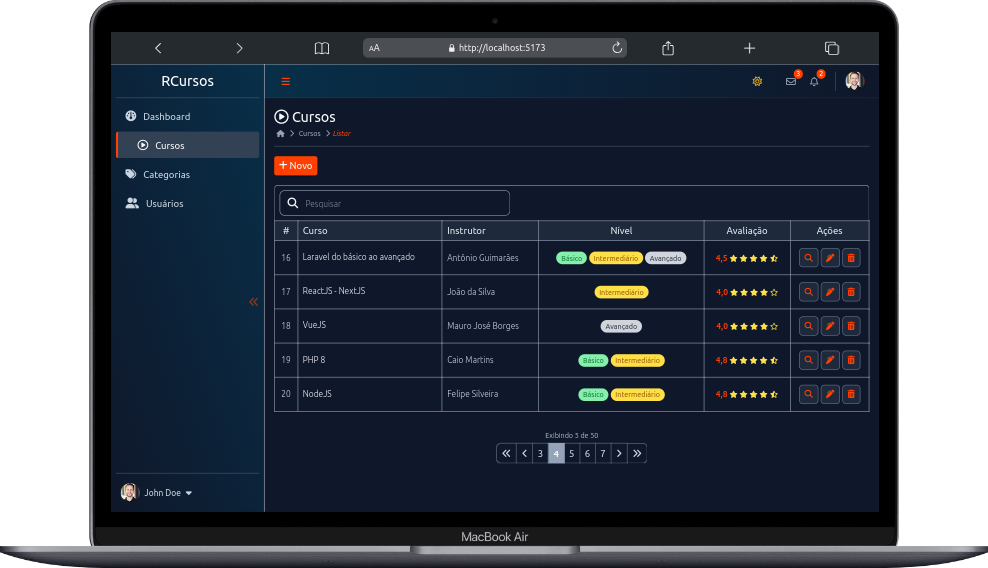
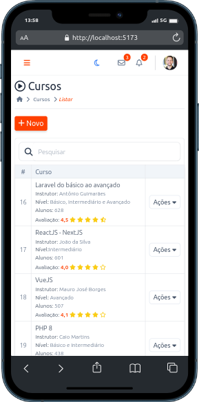
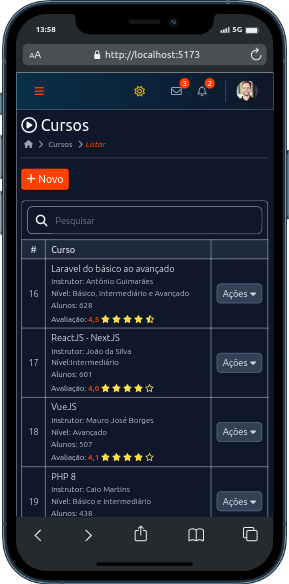
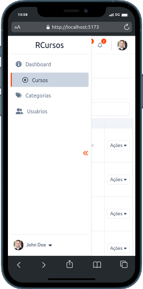
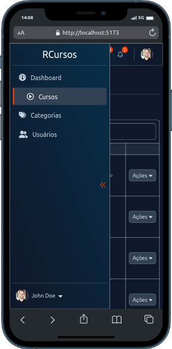

<h1 align="center" id="project_name">
  <br />          
    
    
     
  <br />
</h1>

<p align="center">
 Admin Template Dashboard with Tailwind CSS.
</p>

<p align="center">
  <!-- GitHub last commit -->
  <a href="https://github.com/risaltte/dashboard-tailwindCSS/commits/master">
    
  </a>
  <!-- GitHub language count -->
  
  <!-- GitHub top language -->
  
  <!-- Repository size -->
  
  <!-- Repository status -->
  
  <!-- Link repo -->
  <a href="https://github.com/risaltte/dashboard-tailwindCSS/blob/master/LICENSE">
    
  </a>
</p>

<p align="center">
 <a href="#about">About</a> •
 <a href="#layout">Layout</a> • 
 <a href="#technologies">Technologies</a> • 
 <a href="#prerequisites">Prerequisites</a> •
 <a href="#demo">Demo</a> •
 <a href="#author">Autor</a> • 
 <a href="#license">License</a>
</p>

<p align="center">
  
</p>

<h4 align="center">
  	🚧 Admin Template Dashboard with Tailwind CSS | Done 🚧
</h4>

<h2 id="about">
💻 About
</h2>

Dashboard Template with Tailwind CSS is a dummy admin template created to apply knowledge of [Tailwindcss](https://tailwindcss.com/) and [AlpineJS](https://alpinejs.dev/). The Template is responsive and has dark mode support.

<h2 id="layout">🎨 Layout</h2>
<p>
    The layout was made from some inspirations in other dashboard templates available on the internet.
</p>

<p align="center">
  
</p>

<p align="center">
  
</p>

<p align="center" style="display: flex; align-items: flex-start; justify-content: center; flex-direction: column; gap: 16px;">
  

  
</p>

<p align="center" style="display: flex; align-items: flex-start; justify-content: center; flex-direction: column; gap: 16px;">
  

  
</p>

<br />
<h2 id="technologies">🛠 Technologies</h2>

The following tools were used in the construction of the project:

- **[Tailwind](https://tailwindcss.com/)**
- **[AlpineJS](https://alpinejs.dev/)**
- **[Vite](https://vitejs.dev/)**

> See more [package.json](package.json)

**Utilities**


- Tooltips | Popover: **[TippyJS](https://tippyjs.bootcss.com/)**
- Cookie management: **[JS-Cookie](https://www.npmjs.com/package/js-cookie)**
- Icons: **[Fontawesome](https://fontawesome.com/)**

<h2 id="prerequisites">💿 How to run the project</h2>

### 🧰 Prerequisites

Before you start, you will need to have the following tools installed on your machine:

> [Git](https://git-scm.com), [Node.js](https://nodejs.org/en/) or [Yarn](https://yarnpkg.com/) if you prefer.
> In addition it is good to have an editor to work with the code as [VSCode](https://code.visualstudio.com/)

### 🧭 Running the Project

```bash
# Clone repo
$ git clone https://github.com/risaltte/dashboard-tailwindCSS.git

# Access the project folder in the terminal/cmd
$ cd dashboard-tailwindCSS

# Install the dependencies (npm or yarn)
$ npm install

# Run the application in development mode
$ npm run dev

# see on http://localhost:5173

```

<h2 id="demo">🧪 Demo</h2>
<a style="margin-left: 16px" href="https://risaltte.github.io/design-system/" target="_blank">
<!-- Link externo ou local(.github). -->
  
</a>

<h2 id="author">🦸 Autor</h2>
<a href="https://github.com/risaltte">
 
 <br />
 <sub><b>Rafael Risalte</b></sub></a>

[](https://www.linkedin.com/in/rafaelrisalte/)
[](mailto:risaltte@gmail.com)

<h2 id="license">📝 License</h2>

Distributed under MIT license. See [LICENSE](LICENSE) for more information.

Made with ❤️ by Rafael Risalte 👋🏽 [Contact!](https://www.linkedin.com/in/rafaelrisalte/)

[⬆ Back to top](#project_name)<br />
